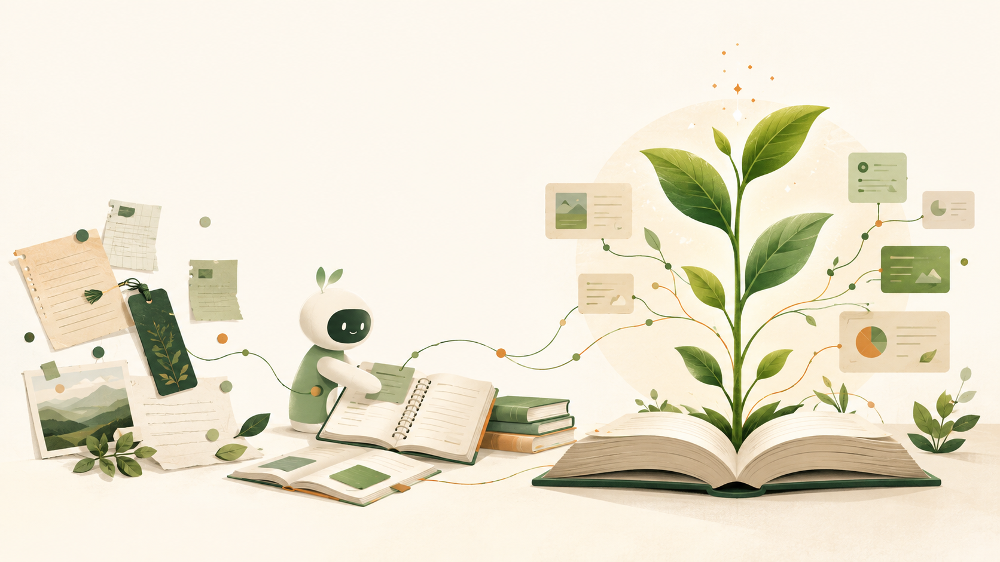

# 萌芽知识库 · mengya-knowledge

萌芽知识库是在卡帕西 LLM Wiki 思路的基础上，结合我自己的学习和内容创作习惯做的一次升级迭代。

保留原有的「原始资料库 + Wiki」核心分工，对应这里的「外部资源」和「Wiki」，再加入灵感、进行中、成品、历史记录和自己的 Skills。从突然冒出来的一个想法，到正在推进的事情，再到最后的作品和长期积累的知识，都有地方可以放。

**[进入知识库](萌芽知识库/首页.md)** · **[阅读 Wiki](萌芽知识库/06-Wiki/知识首页.md)** · **[查看工作流](萌芽知识库/05-Skills/知识库工作流.md)**

## 目录

| 位置 | 这里放什么 |
| --- | --- |
| [00-灵感库](萌芽知识库/00-灵感库/灵感随记.md) | 记平时突然冒出来的想法。想到什么记什么，先不用整理，也不用管写得完不完整，主打一个「随地大小记」。 |
| [01-进行中](萌芽知识库/01-进行中/进行中入口.md) | 放现在正在做的事情，比如正在写的一期视频脚本，或最近正在看的一本书。只要还在继续，就放在这里，主要由自己记录想法、草稿和进度。 |
| [02-成品库](萌芽知识库/02-成品库/成品入口.md) | 放进行中的事情完成后整理出来的视频脚本、文章和完整读书笔记。以后想重新阅读或继续使用，直接来这里找。 |
| [03-外部资源](萌芽知识库/03-外部资源/资源说明.md) | 保留卡帕西知识库中「原始资料库」的定位，存放从外部收集回来的文章、网页、图片等资料。原文和出处留在这里，供后续整理和查证。 |
| [04-历史记录](萌芽知识库/04-历史记录/历史记录说明.md) | 放从「进行中」归档的内容，包括已经结束或暂时不再继续的事情，保留之前的内容和进度，以后想重新开始，还能接着往下做。也保存旧方案和调整记录；本地 ZIP 备份不上传。 |
| [05-Skills](萌芽知识库/05-Skills/使用说明.md) | 放我们自己的技能，把常用的处理步骤和工作方法保存下来，需要时交给 AI 读取并使用。 |
| [06-Wiki](萌芽知识库/06-Wiki/知识首页.md) | 保留卡帕西知识库中 Wiki 的定位：由 AI 协助把原始资料整理成有来源、相互关联、持续更新的知识。以后围绕一个问题查资料、找关联，就从这里开始。 |

「进行中」的事情做完后，**最终作品放进成品库，过程和进度归入历史记录**。外部资源保存「收集到了什么」，Wiki 积累「从这些资料中理解了什么」。这里保留的是卡帕西方案的核心分工，并结合个人使用做了扩展。

## 怎样使用

把下面这段提示词发给 AI Agent，让它帮你搭建自己的知识库：

```text
请使用这个仓库帮我搭建个人知识库：https://github.com/ThreeFrontTeeth/mengya-knowledge 。先阅读仓库说明和工作规则，下载到本地并按现有结构配置好，再带我整理第一份资料。
```

## 当前内容

已有 [LLM Wiki 概念页](萌芽知识库/06-Wiki/概念/LLM%20Wiki.md) 和 [本库维护取舍](萌芽知识库/06-Wiki/分析/萌芽知识库的维护取舍.md)。分领域目录随实际内容增加，后续验证见 [知识库使用验证](萌芽知识库/01-进行中/知识库使用验证.md)。

## 参考与来源

- [Andrej Karpathy 的 LLM Wiki 思路](https://gist.github.com/karpathy/442a6bf555914893e9891c11519de94f)：原始资料与持续维护的 Wiki 分层。
- [SherwinQ/karpathy-wiki](https://github.com/SherwinQ/karpathy-wiki)：基于该思路的第三方 Agent Skill 实现；本仓库参考其知识处理流程和介绍方式，未安装或集成该 Skill。

外部资料保留各自来源，第三方内容权利归原作者所有；保存于本库不代表获得再分发授权。本仓库暂未添加统一开源许可证。

## 让知识慢慢生长



*AI 生成的概念插画：从收集资料，到整理关联，再到积累知识。*
